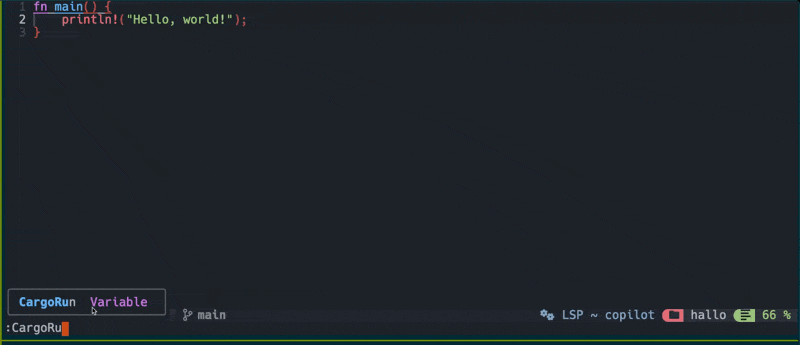

# 🚀 cargo.nvim

[](https://github.com/nwiizo/cargo.nvim/actions/workflows/rust.yml)
[](https://github.com/nwiizo/cargo.nvim/actions/workflows/lua.yml)

---

📦 A Neovim plugin that provides seamless integration with Rust's Cargo commands. Execute Cargo commands directly from Neovim with a floating window interface.



## ✨ Features

- 🔧 Execute Cargo commands directly from Neovim
- 🪟 Real-time output in floating windows
- 🎨 Syntax highlighting for Cargo output
- ⚡ Asynchronous command execution
- 🔄 Auto-closing windows on command completion
- ⌨️ Easy keyboard shortcuts for window management
- 📟 Terminal mode for interactive applications

## 📑 Table of Contents

- [🚀 cargo.nvim](#-cargonvim)
  - [✨ Features](#-features)
  - [📑 Table of Contents](#-table-of-contents)
  - [📥 Installation](#-installation)
    - [Using lazy.nvim](#using-lazynvim)
    - [Using packer.nvim](#using-packernvim)
  - [📋 Requirements](#-requirements)
  - [🛠️ Available Commands](#️-available-commands)
  - [⚙️ Configuration](#️-configuration)
  - [⌨️ Key Mappings](#️-key-mappings)
  - [🔄 Interactive Mode](#-interactive-mode)
  - [📟 Terminal Mode](#-terminal-mode)
  - [👥 Contributing](#-contributing)
  - [📜 License](#-license)
  - [💝 Acknowledgements](#-acknowledgements)
  - [🎉 Related Projects](#-related-projects)

## 📥 Installation

### Using [lazy.nvim](https://github.com/folke/lazy.nvim)

```lua
{
  "nwiizo/cargo.nvim",
  build = "cargo build --release",
  config = function()
    require("cargo").setup({
      float_window = true,
      window_width = 0.8,
      window_height = 0.8,
      border = "rounded",
      auto_close = true,
      close_timeout = 5000,
    })
  end,
  ft = { "rust" },
  cmd = {
    "CargoBench",
    "CargoBuild", 
    "CargoClean",
    "CargoDoc",
    "CargoNew",
    "CargoRun",
    "CargoRunTerm",
    "CargoTest",
    "CargoUpdate",
    "CargoCheck",
    "CargoClippy",
    "CargoAdd",
    "CargoRemove",
    "CargoFmt",
    "CargoFix"
  }
}
```

### Using [packer.nvim](https://github.com/wbthomason/packer.nvim)

```lua
use {
  "nwiizo/cargo.nvim",
  run = "cargo build --release",
  config = function()
    require("cargo").setup({
      float_window = true,
      window_width = 0.8,
      window_height = 0.8,
      border = "rounded",
      auto_close = true,
      close_timeout = 5000,
    })
  end,
}
```

## 📋 Requirements

- 💻 Neovim >= 0.9.0
- 🦀 Rust and Cargo installed on your system
- 📚 Additional dependencies:
  - **Ubuntu/Debian:** `libluajit-5.1-dev` (Install with `sudo apt install libluajit-5.1-dev`)
  - **macOS:** `luajit` (Install with `brew install luajit`)
  - For other Linux distributions, you may need to install an equivalent LuaJIT development package

If you encounter build errors mentioning `lluajit-5.1` during installation, you likely need to install the LuaJIT development package for your system.

## 🛠️ Available Commands

### Core Commands
- 📊 `:CargoBench` - Run benchmarks
- 🏗️ `:CargoBuild` - Build the project
- 🧹 `:CargoClean` - Remove generated artifacts 
- 📚 `:CargoDoc` - Generate project documentation
- ✨ `:CargoNew` - Create a new Cargo project
- ▶️  `:CargoRun` - Run the project in a floating window
- 📟 `:CargoRunTerm` - Run the project in terminal mode (better for interactive applications)
- 🧪 `:CargoTest` - Run tests
- 🔄 `:CargoUpdate` - Update dependencies

### Additional Commands
- 🔍 `:CargoCheck` - Check the project for errors
- 📋 `:CargoClippy` - Run the Clippy linter
- ➕ `:CargoAdd` - Add dependency
- ➖ `:CargoRemove` - Remove dependency
- 🎨 `:CargoFmt` - Format code with rustfmt
- 🔧 `:CargoFix` - Auto-fix warnings
- 📦 `:CargoPublish` - Publish package
- 📥 `:CargoInstall` - Install binary
- 📤 `:CargoUninstall` - Uninstall binary
- 🔎 `:CargoSearch` - Search packages
- 🌲 `:CargoTree` - Show dependency tree
- 📦 `:CargoVendor` - Vendor dependencies
- 🛡️ `:CargoAudit` - Audit dependencies
- 📊 `:CargoOutdated` - Check outdated dependencies
- 🤖 `:CargoAutodd` - Automatically manage dependencies

## ⚙️ Configuration

You can customize cargo.nvim by passing options to the setup function:

```lua
require("cargo").setup({
  -- Window settings
  float_window = true,          -- Use floating window
  window_width = 0.8,           -- Window width (80% of editor width)
  window_height = 0.8,          -- Window height (80% of editor height)
  border = "rounded",           -- Border style ("none", "single", "double", "rounded")
  wrap_output = true,           -- Enable text wrapping in output window
  show_line_numbers = true,     -- Show line numbers in output window
  show_cursor_line = true,      -- Highlight current line in output window
  
  -- Auto-close settings
  auto_close = true,            -- Auto close window on success
  close_timeout = 5000,         -- Close window after 5000ms
  
  -- Timeout settings
  run_timeout = 300,            -- Timeout for cargo run in seconds
  interactive_timeout = 30,     -- Inactivity timeout for interactive mode
  
  -- Advanced behavior options
  force_interactive_run = true, -- Always treat cargo run as interactive mode
  max_inactivity_warnings = 3,  -- Maximum number of inactivity warnings before termination
  detect_proconio = true,       -- Enable detection of proconio usage
  force_smart_detection = true, -- Always use smart detection for interactive programs
  
  -- Key mappings (customizable)
  keymaps = {
    close = "q",
    scroll_up = "<C-u>",
    scroll_down = "<C-d>",
    scroll_top = "gg",
    scroll_bottom = "G",
    interrupt = "<C-c>",
    toggle_wrap = "w",
    copy_output = "y",
    clear_output = "c",
  },
})
```

## ⌨️ Key Mappings

In the floating window:
- `q` or `<Esc>` - Close the window
- `<C-c>` - Cancel the running command
- `<C-u>` - Scroll up
- `<C-d>` - Scroll down
- `gg` - Scroll to top
- `G` - Scroll to bottom
- `w` - Toggle text wrapping
- `y` - Copy all output to clipboard
- `c` - Clear output

## 🔄 Interactive Mode

For interactive programs that require user input:
- An input field appears at the bottom of the window when needed
- Enter your input and press Enter to send it to the program
- The plugin automatically detects when a program is waiting for input
- The window automatically closes after a period of inactivity (configurable)
- Interactive mode timeout prevents hanging processes and memory leaks

## 📟 Terminal Mode

For highly interactive applications (e.g., using proconio or TUI applications):
- Use `:CargoRunTerm` to run your application in a terminal emulator inside a floating window
- Supports full terminal capabilities for interactive Rust applications
- Useful for:
  - Competitive programming with libraries like proconio
  - Text-based UI applications
  - Programs requiring advanced terminal input/output
- Provides a better experience than the standard `:CargoRun` for interactive applications

### Terminal Mode Key Mappings
- `q` or `<Esc>` - Close the window (after program completion)
- `<C-\><C-n>` - Switch to normal mode (while running)
- `<C-c>` - Send interrupt signal
- `<C-d>` - Send EOF signal

## 👥 Contributing

Contributions are welcome! Please feel free to submit a Pull Request.

1. 🍴 Fork the repository
2. 🌿 Create a feature branch
3. ✍️ Commit your changes
4. 🚀 Push to the branch
5. 📫 Open a Pull Request

## 📜 License

MIT License - see the [LICENSE](LICENSE) file for details.

## 💝 Acknowledgements

This plugin is inspired by various Neovim plugins and the Rust community.

## 🎉 Related Projects

- [cargo-autodd](https://github.com/nwiizo/cargo-autodd) - A tool for automatic dependency management
